# Akshay Dipta
## Evidence Brief for the Promotion Panel
### Vice President / Senior Engineer, Technology Data and Innovation

Client Life Cycle Management, London Cadbury Team
Prepared September 2026 for the second round review

---

## How To Use This Document

You have an hour with me, and then five minutes in front of the wider panel. Those are two different jobs, so this document does two things.

**For the hour.** Sections 2 to 10 are the detail. Each one is self contained, so you can open at any section and it will make sense without the ones before it. Every section follows the same shape, which means once you have read one you know where to find things in all of them.

- **The problem**, in language that needs no banking or engineering background
- **What I personally did**, separated from what the wider team did
- **The design decisions I owned**, with the alternative I rejected and why
- **Evidence**, with numbers and where each number comes from
- **Screenshots and links**
- **How it maps to the framework**, tagged to the behaviours and capabilities
- **So what**, the business outcome in one line

**For the five minutes.** Appendix E is written as your script. It is the whole case compressed to what you would actually say out loud to a room that has never met me.

**A note on honesty.** Section 6 and Appendix D contain the weaknesses in my work, written down. I would rather you heard them from me first than found them in a question. Section 5 contains an explicit statement of what I did and did not do on the headline result, because the bank wide article credits a programme and not an individual, and I do not want either of us caught overclaiming.

**A note on language.** I have avoided abbreviations throughout. Where a term is unavoidable it is explained on first use, and Appendix C is a glossary.

---

## 1. The Case In One Page

I am a Senior Engineer in the part of the bank that proves it knows who its clients really are. Before Deutsche Bank can take on a corporate client, it has to establish who owns that company, who runs it, and whether the paperwork stands up to a regulator. My team builds the platform that does that work. I have thirteen years in financial technology, at JP Morgan, HSBC, American Express and now here. I joined Deutsche Bank in March 2023.

**The six things worth remembering about me.**

1. **Two years ago my business unit had no artificial intelligence capability at all.** Today it has two workflows running in production. Both of them run on a framework I researched, designed and built myself. I called it Nexus AI.

2. **I made the call that decided the technology direction, and then I paid for it.** The team was heading towards a Python based solution. Every service, every piece of infrastructure and every engineer in our unit is Java. I argued that a second language would leave us with a parallel stack nobody could integrate or maintain, I took that case to technical management, and I won it. The cost of that choice was giving up the Python tooling, so I rebuilt the missing piece myself. Nexus AI Studio draws every workflow as a live picture and lets the instructions the agents follow be compared and changed without a software release. It is deliberately compatible with the industry standard tool it replaces.

3. **The first workflow reached the national press, and then the bank's own front page.** It cut a client onboarding step from seventy seven minutes to under ten, runs at over ninety nine and a half percent right first time, and costs fifty seven percent less per case. In June 2026 the bank chose it as one of only three artificial intelligence applications it demonstrated to national media in India, and it was named in *The Hindu*. In August it was published on the bank's internal network and rated 4.6 out of 5 by sixty six readers, with the Co-Head of Operations and Controls for the Corporate Bank and Investment Bank quoted in it.

4. **The second workflow I own end to end, and it is the harder one.** It works out who ultimately owns and controls a corporate client, tracing through layers of holding companies, funds and trusts across documents in several languages. It has been live for a hundred users since August 2026. There are two hundred and sixty five automated tests on it, because I treat the instructions we give artificial intelligence as production code rather than as prose.

5. **Both of those workflows stand on a platform I built, and I still own it.** At the centre of our documents platform is a state machine I built. It calculates the state of every compliance question and of every document, which is what decides when a question is ready to be worked and whether a document can be relied on as evidence. On top of it I built automatic association of documents to the questions they answer, and automatic dissociation when a newer document supersedes an older one. Both live workflows only see work that state machine released, and only act on documents it marked good. The platform has contributed five million euros in savings and over forty thousand document operations with no human involvement. I was fixing production issues in it this month. Underneath all of that, our messaging could not handle load and lost messages permanently on any outage, so I designed a new messaging library with automatic retry. Analyst wait times went from thirty to sixty minutes down to seconds, and it now carries half a million messages a day.

6. **I contribute outside the bank as well as inside it.** I contributed a new integration module to LangChain4j, the open source Java framework our artificial intelligence platform is built on.

**Everything in one table.**

| What | Before | After | Where the number comes from |
|---|---|---|---|
| Finding a client's senior managers | 77 minutes per case | Under 10 minutes | Bank intranet article, 25 Aug 2026 |
| Accuracy of that workflow | Not measured | Over 99.5% right first time | Same article |
| Cost of that workflow | 19.87 euros per case | 8.51 euros per case, 57% lower | Cost analysis presented by a Managing Director |
| Building an artificial intelligence agent | A full working day | About one hour | Nexus AI adoption across the unit |
| Analyst wait for a calculation result | 30 to 60 minutes | Seconds | Messaging rebuild |
| Message throughput | Daily backlogs | 500,000 messages a day | Messaging rebuild |
| Document handling | Manual linking by analysts | 40,000 plus operations with no human involved | Documents and state platform |
| Savings contributed to | | 5 million euros | Documents and state platform |

**What I am asking you to conclude.** That I operate at the level the Vice President and Senior Engineer role describes. I set technical direction for a business unit rather than for a team, I own solution design and not just delivery, I partner with the business rather than take orders from it, and I have production evidence rather than proposals.

---

## 2. Nexus AI, The Platform I Built

### The problem

In 2024 the bank began taking artificial intelligence seriously. My business unit had no capability of its own. Any team that wanted to build something started from a blank page, wired up a model connection by hand, invented its own way of handling failures, and wrote its own validation. Building a single working agent took a full day. Worse, every team solved the same problems in a slightly different way, which meant nothing was reusable and nothing could be governed consistently.

An agent, in this context, is a piece of software that gives a task to a large language model, gives it a set of tools it may use, and does something with the answer.

### What I personally did

I researched the problem, built the proof of concept, designed the architecture, and delivered the framework. That work was mine end to end and was not delegated. The architecture documentation on the internal wiki is authored by me.

### The design decisions I owned

**Decision one. Java, not Python.**

The prevailing direction was a Python based solution, because that is where most of the artificial intelligence tooling lives. I argued against it.

Every service in our business unit is Java and Spring Boot. Every engineer in it is a Java engineer. Our deployment pipeline, our monitoring, our security scanning and our release process are all built around Java. A Python stack would have meant a second set of everything, maintained by people who do not write Python, integrated across a boundary that would have to be built and then supported. The apparent shortcut of adopting the ecosystem where the libraries are would have cost us more in integration and support than it saved in library availability, permanently.

I took that case to technical management and convinced them. Everything that follows depends on that decision having been right, and the two production workflows are the evidence that it was.

**Decision two. Two tiers, not one.**

The natural instinct is to build one orchestration layer that does everything. I separated the framework into two tiers with a deliberate boundary between them, because the two kinds of work have genuinely different needs.

*Tier one is the workflow graph.* It is built on LangGraph4j. A workflow is a directed graph. Nodes are processing steps, each a Java class implementing `AsyncNodeAction`, and each a Spring managed bean with full access to dependency injection. Edges define execution order and can be sequential, conditional or parallel. A typed graph state object carries data between nodes, and it is immutable between node boundaries, so a node receives a snapshot and returns updates rather than mutating shared state.

There are three node types. A non artificial intelligence node runs plain Java logic such as file handling, an interface call or a data transformation. An artificial intelligence node delegates to tier two. A decision node evaluates a condition and routes down a different edge.

*Tier two is the agent pipeline.* This is Nexus AI proper, built on LangChain4j. Inside a single artificial intelligence node it composes and runs one or more agents.

The boundary is the point. Tier one answers the question "what steps does this workflow have". Tier two answers "how does this one artificial intelligence step work internally". A node in tier one can be as simple as downloading a file or as complex as a twelve agent extraction pipeline, and tier one does not need to know which. That means infrastructure concerns and model orchestration concerns evolve independently, and an engineer working on one does not need to understand the other.

**Decision three. Declarative agents, not imperative ones.**

An agent is declared as an `AgentSpec`, a configuration object rather than code. It carries a name, its declared inputs, the scope key it writes its output to, the tools it may call, input and output guardrails, a limit on sequential tool executions, and a listener for observability.

`AgentFactory` then composes agents through four methods.

| Method | Behaviour |
|---|---|
| `create(AgentSpec)` | Creates a single agent from a spec. Loads its prompt from the database, configures the model, registers tools and guardrails |
| `sequence(outputKey, agents...)` | Agents run one after another. Each reads the previous agent's output from shared scope |
| `parallel(outputKey, agents...)` | Agents run concurrently. All read the same scope state, results written independently |
| `loopAtEnd(max, predicate, agentA, agentB)` | Two agents loop until a predicate is true or a maximum is reached |

These patterns nest arbitrarily. A sequence can contain parallel groups which can contain sub sequences. The practical consequence is that a five agent workflow is roughly thirty lines of configuration rather than a bespoke program.

State passes through `AgenticScope`, a shared container within one artificial intelligence node. Each agent reads inputs matched by its declared input keys and writes under its declared output key. The wiring is automatic, which removes the most common source of bugs in multi agent code, which is passing state between agents by hand.

**Decision four. Prompts in the database, not in the code.**

The instructions given to a model are stored as versioned rows in a database table rather than compiled into the application. A prompt change is a new version and a deployment, never an edit to a running row. This means the people who write prompts iterate without waiting on a code release, and every historical version of every instruction is retrievable for audit. That last property is not a convenience in a regulated process, it is a requirement.

**Decision five. Guardrails that do not depend on the model behaving.**

Validation is deterministic Java that runs before and after the model call, not an instruction in the prompt asking the model to behave. Guardrails are reusable Spring beans.

Input guardrails return one of three outcomes.

| Outcome | Method | Effect |
|---|---|---|
| Pass | `success()` | Input valid, proceed to the model call |
| Rewrite | `successWith(text)` | Input modified, proceed with the modified version |
| Block | `fatal(reason)` | Input invalid, the model call never happens |

Output guardrails also return three.

| Outcome | Method | Effect |
|---|---|---|
| Pass | `success()` | Output valid |
| Retry | `retry(reason)` | Output invalid, re-invoke with the same prompt |
| Halt | `fatal(reason)` | Unrecoverable, halt with an exception |

**Decision six. Solving the output token limit properly.**

A model has a hard ceiling on how much it can produce in one response. An agent asked to extract two hundred records will hit that ceiling and return truncated output, and truncated output in a compliance process is worse than no output because it looks complete. I built `BatchAccumulatorTool`, which gives the model a tool to submit results in batches and paginate its own output. The workflow produces correct results whether the answer is ten records or five hundred, and the calling code does not change.

### How failure is handled

Reliability is layered rather than concentrated in one place.

| Layer | Tier | Mechanism | What it catches |
|---|---|---|---|
| Graph node retry | One | Conditional edges and retry logic | Node failures, infrastructure errors, timeouts |
| Model provider | Two | Retry built into the model client | Rate limiting, provider errors, network timeouts |
| Input and output guardrails | Two | Reprompt and retry | Malformed output, missing fields, quality violations |
| Loop pattern | Two | `loopAtEnd(max, predicate)` | Iterative refinement until a quality threshold is met |
| Batch tool | Two | `submit_batch()` | Output ceiling exceeded, model paginates automatically |

Both tiers are observable. Tier one records every node execution. Tier two records every agent execution including the prompt used, the inputs, the outputs and the timings, persisted to the database. In a regulated process that end to end trail is the difference between a system that can be deployed and one that cannot.

### Evidence

- Building an agent went from a full working day to about an hour.
- A typical new workflow of three to five agents takes one to two days to build, roughly half a day for the agent specifications and pipeline composition and half a day for the graph wiring and testing.
- Adopted across the business unit rather than by one team.
- Two production workflows run on it, described in sections 5 and 6.
- Under review by the Chief Strategy and Innovation Office as a candidate bank wide standard framework, following a review by a Director level Lead Data Scientist.
- Demonstrated to a Managing Director's technology team in another division, who expressed interest in onboarding.
- Taught to the wider business unit in a knowledge sharing session on 11 June 2026, attended by 140 people. Detail in section 9.

### Screenshots and links

Architecture documentation, authored by me, on the internal wiki:
`confluence.intranet.db.com/spaces/COB/pages/1964550338/CLM+AI-Driven+Workflow+Framework+Architecture+Documentation`

Source repository: [LINK: Nexus AI repository]

Recorded walkthrough: I presented the framework end to end to 140 colleagues on 11 June 2026. The recording runs 1 hour 24 minutes and the transcript is alongside it. If you would rather watch the architecture argument than read it, that is the fastest route. Recording: [LINK: 11 Jun 2026 session recording]. Transcript: [LINK: session transcript]. Full detail on the session is in section 9.

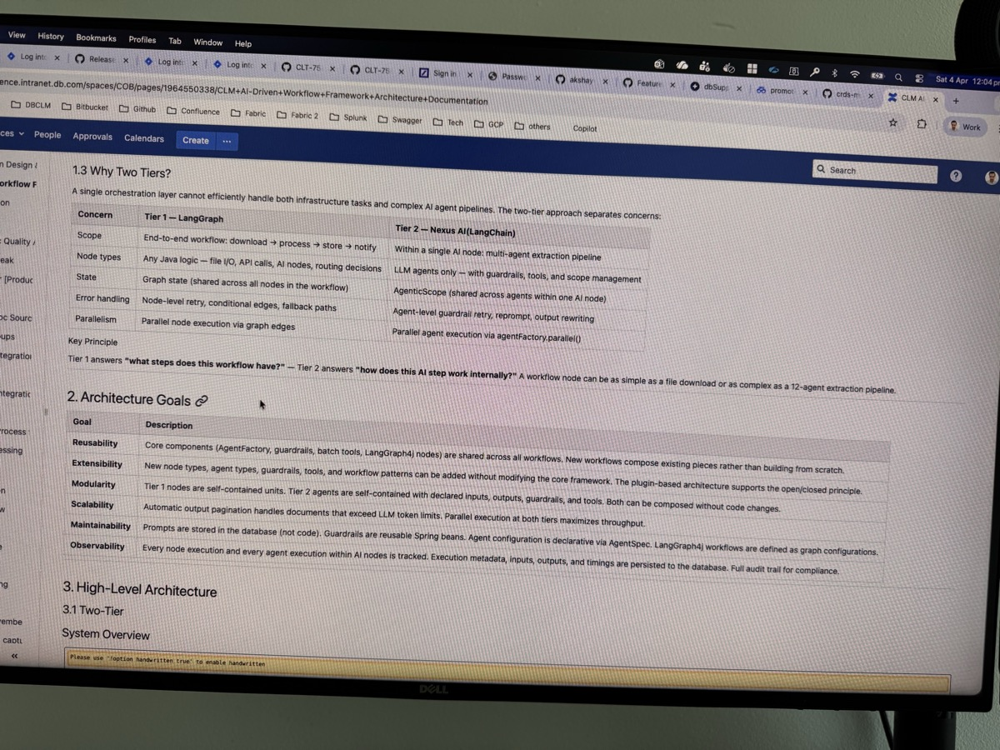

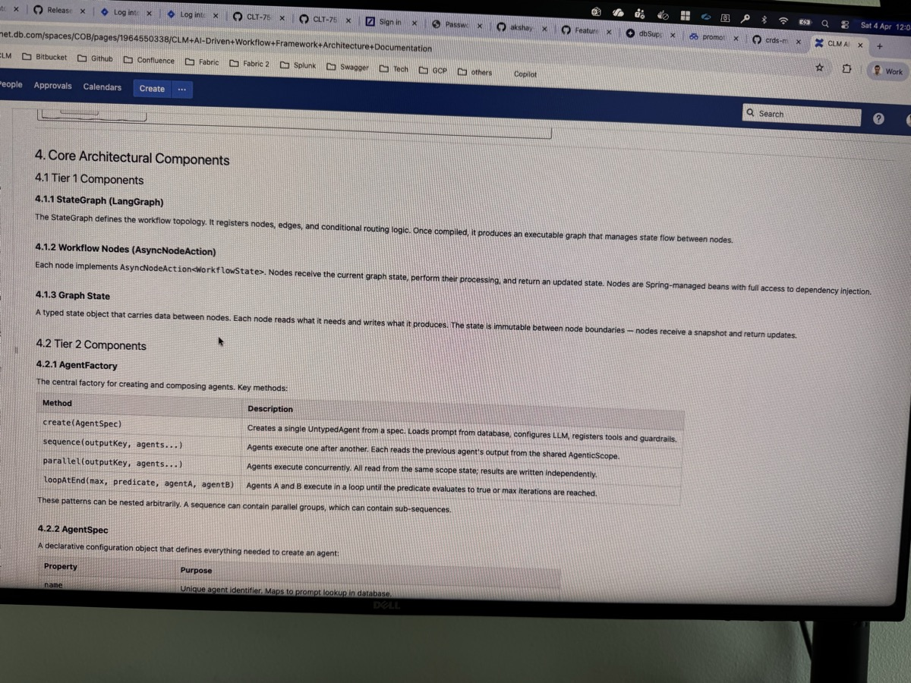

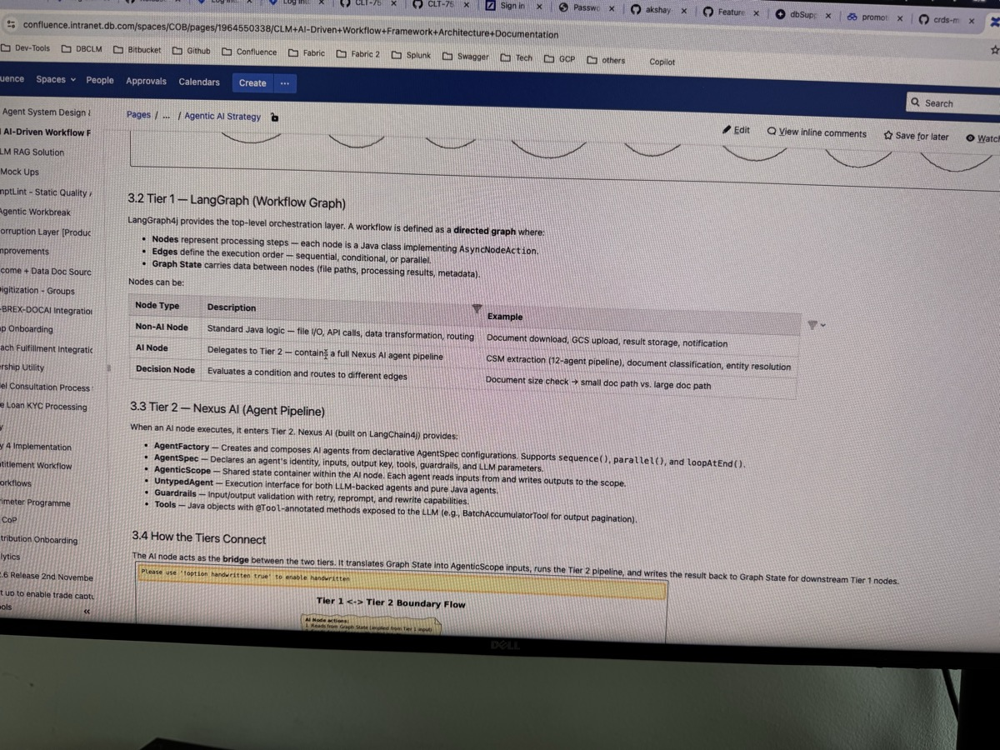

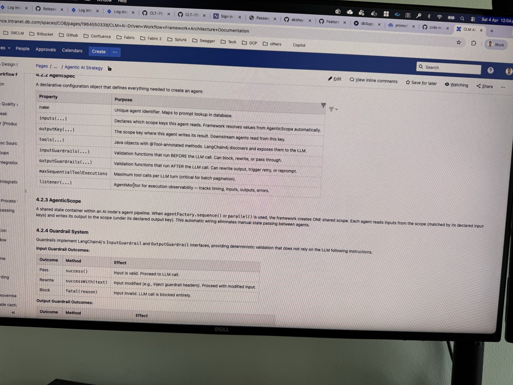

### Framework mapping

**Thinks.** Recognised that the unit needed an architectural answer rather than a series of one off agents, and designed one.
**Designs.** Two tier architecture, composition model, guardrail system, state management and output pagination, all designed from nothing.
**Delivers.** Shipped and in production, carrying two live workflows.
**Influences.** Reversed the technology direction of a business unit by argument, and set the pattern every subsequent workflow follows.
**Engages.** Built so that other teams can use it without needing me.
**Controls.** Guardrails, versioned prompts and a full audit trail designed in from the start.
**Operates.** Layered retry and full execution observability across both tiers.

### So what

Before this, an artificial intelligence idea in our business unit cost a day of engineering before anyone could tell whether it was worth pursuing. Now it costs an hour. That is the difference between a unit that experiments and a unit that does not.

---

## 3. Nexus AI Studio, Seeing And Steering The Platform

### The problem

The framework solved how to build an agent. It did not solve what happens once agents are running.

Two groups were stuck. Engineers could not see a workflow. To understand one you read the raw graph definition or traced the code by hand, and to follow a run you tailed application logs and correlated timestamps to work out where it stopped. Business users could not touch the instructions the agents follow. Those instructions define what the system extracts and how it classifies, so the people who understand the policy are the right people to change them, and every change went through an engineer.

Both problems have the same root. The platform was invisible.

### What I personally did

I built Nexus AI Studio. It is a separate product from the framework, in its own repository, with its own release. Fifty seven commits between 31 May and 26 August 2026. Around twenty thousand six hundred lines of TypeScript across fifty five components, with five hundred and forty eight automated tests in seventy one files. The stack is Spring Boot 3.3 on the server side, and React 18 with Vite, ELK.js for graph layout and Zustand for state on the client.

It does two things.

**It draws the platform.** Every workflow renders as a laid out graph, including subgraphs, conditional branches and parallel paths. When a workflow runs, the graph animates node by node from a live event stream, with a banner showing the active node, progress through the run and elapsed time. A failed node is highlighted where it failed. State is inspectable at every checkpoint, with the keys that changed since the previous checkpoint badged, and a search inside the data. Several workflows can run at once, each in its own execution slice, so switching what you are looking at never stops a run.

**It manages the instructions.** The prompt screen lists every prompt bound to a workflow, shows any version in full, and puts two versions side by side in a difference view down to the parameters. A version can be saved as a new version and then promoted to be the one the workflow actually runs, and a prompt can be run against the model from the screen to see what it produces before promoting it.

### The design decisions I owned

**Decision one. Compatible with the industry tool, not a private invention.**

The reference implementation for this kind of interface is LangGraph Studio, which belongs to the Python ecosystem. I built Studio to be **API compatible with it**, the same endpoint paths and the same response shapes. A service already exposing those endpoints gets this interface with no change to it at all.

The reason is the Java decision in the previous section. Choosing Java meant giving up the Python tooling. Rather than accept that as a permanent cost, I rebuilt the missing tool and kept its contract, so we get the capability without the second language. This is the point in the story where that architectural decision either holds up or does not, and this is the evidence that it holds up.

**Decision two. A dependency, not a project.**

Studio is a user interface only. It carries no business logic. It is a React application packaged inside a Spring Boot library, served as static assets, activated by Spring auto configuration.

Adopting it is one Maven dependency and one property. There is nothing to build, nothing to deploy separately, and no per service interface to write. It is off unless a service explicitly switches it on, so it can never appear somewhere it was not intended.

This is the same instinct as the messaging library and the shared coding standards. A pattern in a document gets implemented five different ways. A dependency with one switch gets used.

**Decision three. Ship ahead of the backend, and degrade honestly.**

Three of the prompt endpoints, saving a version, promoting a version and running a prompt, went out before the server side existed. Rather than hide them or let them error, an unimplemented endpoint raises a clear "coming soon" notice, and the moment the backend appears the feature lights up by itself with no front end release. Any other error is shown as a real error, and the user's unsaved draft is preserved either way.

The alternative was to hold the whole screen back until every endpoint existed. That would have delayed the value that was already ready, which is the reading and comparing, for the sake of the value that was not.

**Decision four. Per workflow prompt versions, and saving is not deploying.**

One prompt can be shared by two workflows and legitimately run a different version in each, so the version a node runs is pinned by the binding between prompt and workflow rather than by a flag on the prompt itself. There is an older global flag in the table and I deliberately treat it as dead, because two sources of truth for which version is live is exactly how the wrong instruction reaches production.

Saving a new version does not deploy it. Promoting it does. Those are separate actions, because in a regulated process the moment a change goes live has to be a decision somebody made, not a side effect of pressing save.

### Evidence

- A separate product with its own repository and release, not a feature of the framework.
- Fifty seven commits, 31 May to 26 August 2026.
- Five hundred and forty eight automated tests across seventy one files. Running them here, five hundred and forty five pass. The three that do not are one suite expecting a local service on a port that is not running on my machine, and are an environment issue rather than a defect.
- Around twenty thousand six hundred lines of TypeScript across fifty five components.
- Documented on the internal wiki, including a recorded walkthrough.

### Screenshots and links

Source repository: [LINK: nexus-ai-studio repository]

*Further screenshots to be added. Suggested: a run mid execution with the live banner, and the prompt version difference view.*

### Framework mapping

**Thinks.** Recognised that adopting Java left a tooling gap, and closed it by rebuilding the missing tool rather than accepting the gap or reversing the decision.
**Designs.** Compatibility with an existing contract as a deliberate constraint. Zero configuration adoption. Separation of saving a version from deploying one.
**Delivers.** A second shipped product on the platform, with a substantial test suite.
**Engages.** Puts the instructions in front of the people who own the policy, instead of routing every wording change through an engineer.
**Operates.** Live execution visibility and per checkpoint state, replacing log correlation as the way to find out what a workflow did.
**Controls.** Versioned prompts with an explicit promotion step, and a single source of truth for which version is live.

### So what

The framework let us build the platform. This is what lets everyone else see it, understand it, and change it safely. It is also the answer to the obvious challenge to my Java decision, which is that we gave up the tooling. We did not. I rebuilt it.

---

## 4. PromptLint, The Quality Gate

### The problem

The instructions we give a large language model determine what it extracts, how it classifies, and what shape the answer comes back in. They are the most behaviour defining artefact in an artificial intelligence system. Yet across the industry they are treated as prose. There is no linting, no static analysis and no automated quality gate on them.

The consequence is a specific and nasty failure mode. Prompts degrade quietly. Somebody adds a vague sentence, or removes the output schema, or introduces a rule that contradicts one three paragraphs above it. The model starts hallucinating or returning malformed output. Nobody can say when the regression happened, because nobody was testing the prompt. In a compliance process, a silent quality regression is the worst possible kind.

### What I personally did

I built PromptLint. It is a Java library that statically analyses prompt quality and makes no model calls at all. It scores a prompt across eight independent quality dimensions, flags issues by severity, and produces a report. It runs in milliseconds. I authored it and the documentation for it.

### The design decisions I owned

**Decision one. Rule based and deterministic, not model assisted.**

The obvious way to assess prompt quality is to ask a model to assess it. I deliberately did not. A model based checker is slow, costs money on every run, needs credentials, and, most damagingly, is not deterministic. It would produce a different score for the same prompt on different days, which makes it useless as a build gate, because a build gate that fails intermittently gets switched off within a fortnight.

PromptLint is rule based and entirely in process. The same prompt always produces the same score. Its only runtime dependency is Jackson, for validating the JSON examples inside the prompt. That determinism is the reason it can sit in continuous integration and fail a build, which was the entire point of building it.

**Decision two. Eight orthogonal dimensions rather than one score.**

A single quality number tells an author nothing actionable. Eight dimensions tell them what to fix.

| Dimension | Code | What it checks |
|---|---|---|
| Clarity | CLR | Role definition, task statement, imperative verbs, vague language, output format section, task before rules ordering |
| Specificity | SPC | Numbered rules, concrete examples, quantified thresholds, boundary conditions, enumerated constraints |
| Groundedness | GND | Source grounding phrases, anti hallucination guards, evidence requirements, citation instructions |
| Output Contract | OUT | JSON examples present and valid, field level documentation, schema completeness |
| Constraint Coverage | CON | Edge case handling, null and empty handling, error handling, ordering rules, boundary conditions |
| Consistency | CST | Template variables aligned with declared inputs, contradictory instructions, terminology consistency |
| Token Efficiency | TKN | Prompt length against complexity, redundancy detection, filler removal |
| Injection Resistance | INJ | System and user boundary enforcement, input sanitisation, refusal instructions, role lock phrases |

**Decision three. Weight the dimensions by what the agent is for.**

An extraction agent and a formatting agent fail in different ways, so scoring them identically is wrong. An extraction agent that invents facts is dangerous, so groundedness and output contract carry the most weight. A classification agent lives or dies on precise category definitions, so specificity dominates. A formatting agent is judged almost entirely on its output contract.

`PromptTypeProfile` holds those weights, with built in profiles for extraction, classification, formatting, review and a default. The overall score is a weighted average across the eight dimensions using the profile selected for that agent. Custom profiles are supported.

**Decision four. A test assertion interface, because prompts are code.**

`PromptQualityAssert` is a fluent assertion interface for use in ordinary unit tests. An engineer asserts a quality threshold on a prompt in exactly the same way they assert anything else, in the same test run, with the same failure output. This was a deliberate choice to make prompt quality feel like normal engineering rather than a separate discipline with separate tooling, because tooling that sits to one side of the daily workflow does not get used.

### Architecture

The pipeline is deliberately simple. `PromptUnderTest`, then `PromptQualityAnalyzer`, then the eight dimension analyzers running independently, then `PromptQualityReport`.

| Component | Responsibility |
|---|---|
| `PromptUnderTest` | Wraps the prompt with metadata, the system and user text, declared inputs and outputs, and the agent profile |
| `PromptQualityAnalyzer` | Orchestrates the dimension analyzers and aggregates scores using the profile weights |
| `PromptTypeProfile` | Holds dimension weights per agent type |
| `PromptQualityReport` | Overall score, per dimension scores, all findings |
| `PromptQualityReportRenderer` | Renders reports as console output suitable for a build log |
| `PromptQualityAssert` | Fluent assertion interface for unit tests |

Each analyzer returns a score between zero and one. Analyzers are independent of each other, which means a new dimension is added without touching the existing ones.

It is also exposed over a web interface, so teams that do not write Java, and documentation tooling, can use it.

### Evidence

- Eight dimensions, five built in agent profiles, assertion interface and web interface, all delivered.
- Runs in milliseconds with no credentials, no network calls and no flaky tests.
- Runs on every build in continuous integration and fails the build on a regression.
- Documentation authored by me on the internal wiki, created 24 March 2026.
- Custom rule authoring and automatic fix suggestions are on the roadmap and are honestly not built yet.

### Screenshots and links

Documentation on the internal wiki:
`confluence.intranet.db.com/spaces/COB/pages/1979176445/PromptLint+-+Static+Quality+Analyzer+for+LLM+Prompts`

Source repository: [LINK: PromptLint repository]

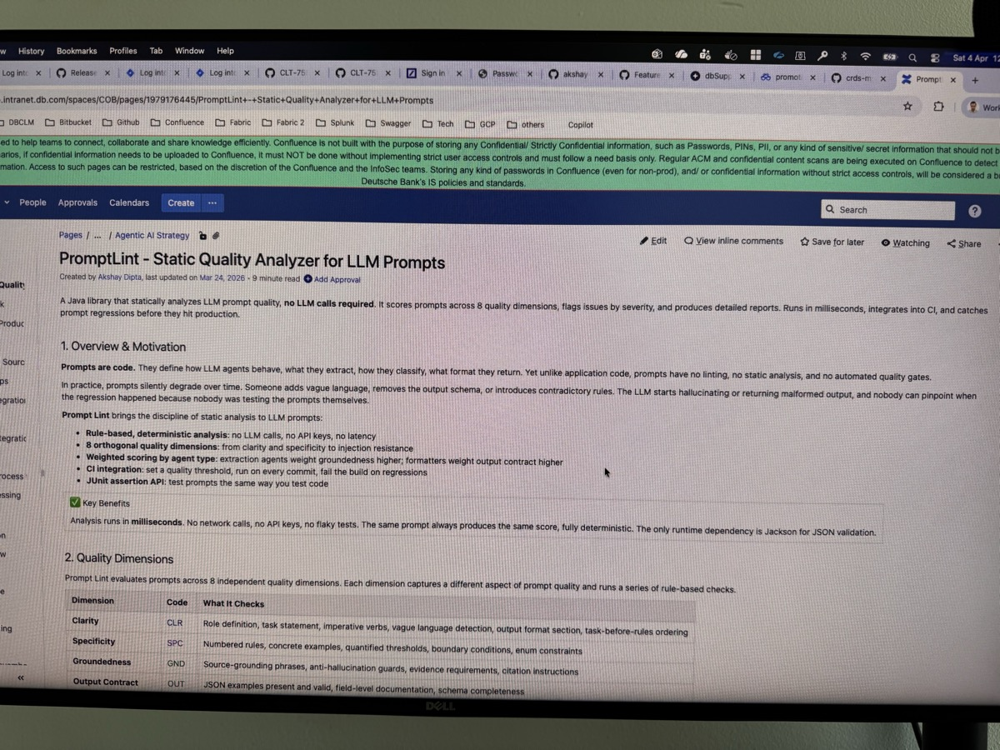

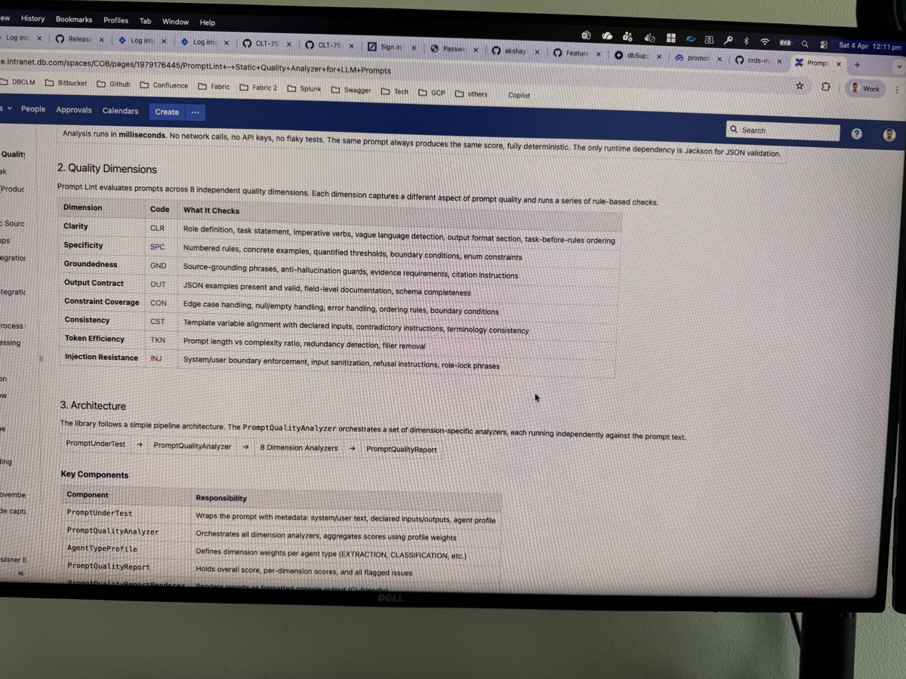

### Framework mapping

**Thinks.** Identified a class of production risk nobody in the unit was managing, and brought an established engineering discipline, static analysis, to a place it had not been applied.
**Designs.** Pluggable analyzers, weighted profiles, deliberate determinism as an architectural constraint rather than an implementation detail.
**Delivers.** Complete and shipped, including the test assertion interface and the web interface.
**Controls.** An automated quality gate on the artefact that governs artificial intelligence behaviour.
**Influences.** Sets the quality standard for prompt engineering across the unit.

### So what

Without this, the only way to discover that an instruction had degraded was for a client case to come out wrong. Now the build catches it, before the change ever reaches a model.

---

## 5. Live Result One, Finding A Client's Senior Managers

### The problem

For every new client relationship, the bank has to identify and verify the senior executives responsible for running the client organisation, and check each of them against policy. An analyst read document after document by hand, identified the candidates, cross checked each name across several separate systems, and tested each one against the policy requirements. It averaged seventy seven minutes per case. It varied between analysts, and it generated rework between the colleagues preparing a case and the colleagues validating it before approval.

### What was built

A workflow of ten agents across five waves, each substantive agent paired with a critic agent that reviews its output. The agents identify the relevant individuals in the documents, normalise and de-duplicate names, classify them against policy, compare the result against what the platform already holds, and answer the related compliance questions. Analysts still review the evidence and make the final decision. Human accountability is preserved by design, not by omission.

It runs on Nexus AI.

### Attribution, stated plainly

**This is the most important paragraph in this document, because it is the one where I could most easily overclaim, and where you could most easily be caught out repeating it.**

This was a cross functional delivery under the Corporate Bank and Investment Bank Know Your Customer Operations artificial intelligence acceleration programme. Know Your Customer specialists defined the business and policy logic. Operations, Technology, Data, Policy, Controls and Transformation all contributed. Live case testing and user feedback shaped the final version. It went from nothing to production in five months. The bank wide article credits the programme and the technology teams, and does not name me.

**What is mine, and what I will defend under questioning:** I built the framework every one of those agents runs on. I delivered the first agentic workflow in the business unit, which is this one. Without the framework there was no vehicle for this work, and the alternative was ten agents hand wired by different people in different styles with no shared guardrails, no shared observability and no versioned prompts.

**What is not mine:** the policy logic, the operational design, the programme, and the headline result as a whole. If asked "did he do this on his own", the correct answer is no, and the reason that is the correct answer is that a workflow like this one cannot be done on one's own. I would rather be judged on having built the thing that made it possible and on having partnered well, than on a claim that will not survive scrutiny.

### Evidence

| Measure | Before | After |
|---|---|---|
| Average processing time per case | About 77 minutes | Under 10 minutes |
| Speed | Baseline | More than seven times faster |
| Right first time accuracy | Not measured | Over 99.5% |
| Cost per case | 19.87 euros of manual effort | 8.51 euros per run |
| Saving per case | | 11.36 euros, 57% lower |

Supporting detail from the cost analysis, covering 7 to 26 June and 1,485 executions including live and back testing:

- Average of sixteen documents per case. The largest single case ran to eighty seven documents and cost 42.80 euros.
- Total spend to date, 12,600 euros across those 1,485 executions.
- Seventy four percent of cost is driven by document processing rather than by model reasoning or output. This matters because it tells you where to optimise, and it is the reason the largest optimisation lever in flight is reducing the number of documents that reach the agents rather than changing model.

Three optimisation levers are being worked now, which is evidence that this is owned rather than delivered and abandoned. Moving specific agents to a cheaper model is expected to take cost from 8.51 to 5.61 euros per run, a thirty four percent reduction. Linking documents to data points so only relevant documents reach the agents attacks the seventy four percent cost driver directly. Replacing agents with generated Java tools where the task does not need a model removes token cost entirely, and one agent has already been converted this way.

### Recognition, external press

**This is public coverage, in a national newspaper, and it came two months before the internal article.**

On 18 June 2026 Deutsche Bank held Bank on Tech, its annual technology showcase, at the Global Capability Centre in Bengaluru, and demonstrated its artificial intelligence work to the technology press. The bank showed **three** applications. This was one of them.

*The Hindu* reported it on 19 June 2026:

> "Another solution, AI Acceleration - client senior manager, a targeted initiative within Know Your Customer (KYC) processes, automates the identification and validation of key client roles. This improves data consistency, reduces manual effort, and accelerates client onboarding timelines."

The other two were Financial Spreading, which automates the extraction and analysis of financial statement data for credit assessment, and dbIntelligence, which runs scenario analysis on geopolitical and market events against portfolio exposure.

Two executives are quoted in the piece.

Denis Roux, Chief Information Officer for the Investment Bank:

> "What we are demonstrating here is how AI is being embedded into the way we run the bank, not as a standalone capability, but as part of how we understand risk, manage controls, and execute core processes."

Gurumurthy Thiagarajan, Head of the India technology centre and Chief Information Officer for People, Procurement and Legal:

> "These solutions show how we are applying AI to real, business-critical processes across the bank, connecting data, reducing manual effort, and improving how decisions are made."

The article also records that the bank claimed these solutions were already helping it, and that the approach was deliberately pragmatic, focused on workflows where measurable value could be delivered.

**Why this matters more than the numbers do.** Deutsche India is the bank's largest technology centre and employs around twenty three thousand people globally. When it chose what to put in front of national media, it chose three things. This was one of them. That is a statement about which work the bank considers strategically representative, made in public, under its own name, and it is not a statement I had any part in writing.

**Attribution, again.** The article names the initiative, not me. The same rule applies as above. What is fair to say is that the work I built the framework for was one of three applications the bank chose to show the press. It is not fair to say the press wrote about me.

### Recognition, internal

Published on the bank's internal network, Technology and Innovation section, on 25 August 2026 and updated the following day, under the headline "How AI cut a key KYC client onboarding step from 77 minutes to 10". Sixty six readers rated it, averaging 4.6 out of 5, with five comments.

Ross Mackenzie, Co-Head of Operations and Controls for the Corporate Bank and Investment Bank, is quoted in it:

> "This is the first production step towards a much more ambitious goal: an AI-augmented, end-to-end KYC process that is faster, more accurate and more scalable, while preserving clear human accountability for every risk decision. We are not simply automating individual tasks. We are redesigning how KYC is performed, using AI to remove manual work, strengthen data quality and allow our team to focus on the judgement that protects our clients and the bank."

The cost and savings analysis was presented to management by Marco Luebbers, a Managing Director, with Tim Ryan.

**At go live, 10 July 2026.** On the week of go live, Ross Mackenzie wrote to the whole accelerator team. He called it "a monumental delivery in the evolution of Deutsche Bank's KYC process, the first agentic workers, that are delivering at a higher level of accuracy and efficiency than could be achieved by human effort", and described it as "a case study in partnership between Technology and Operations". The mail carried the first production numbers, after two days: 258 files processed, maker level accuracy at 91 percent, and no material production issues. Note that the 91 percent there and the over 99.5 percent right first time in the August article are different measures taken seven weeks apart, and the gap between them is the post go live tuning, not a restatement.

Two things about that mail. It was addressed to the accelerator team, not to me personally, and I am one of roughly fifty recipients, so I do not present it as individual recognition. What it does evidence is that the Co-Head of Operations and Controls was engaged with this delivery at go live, and that he closed the mail with "Beneficial Ownership next!", which is the same senior sponsor naming the workflow in section 6 as the next thing the bank wanted. The two live results in this document are a sequence, not two unrelated projects.

### Screenshots and links

External press, *The Hindu*, 19 June 2026:
`thehindu.com/business/deutsche-india-showcases-cutting-edge-ai-applications-that-speed-up-banking-operations/article71118785.ece`

Article on the internal network:
`dbn.intranet.db.com/dbn-news/detail/20260825-from-77-minutes-to-under-10-how-ai-is-simplifying-a-key-client-onboarding-process-step`

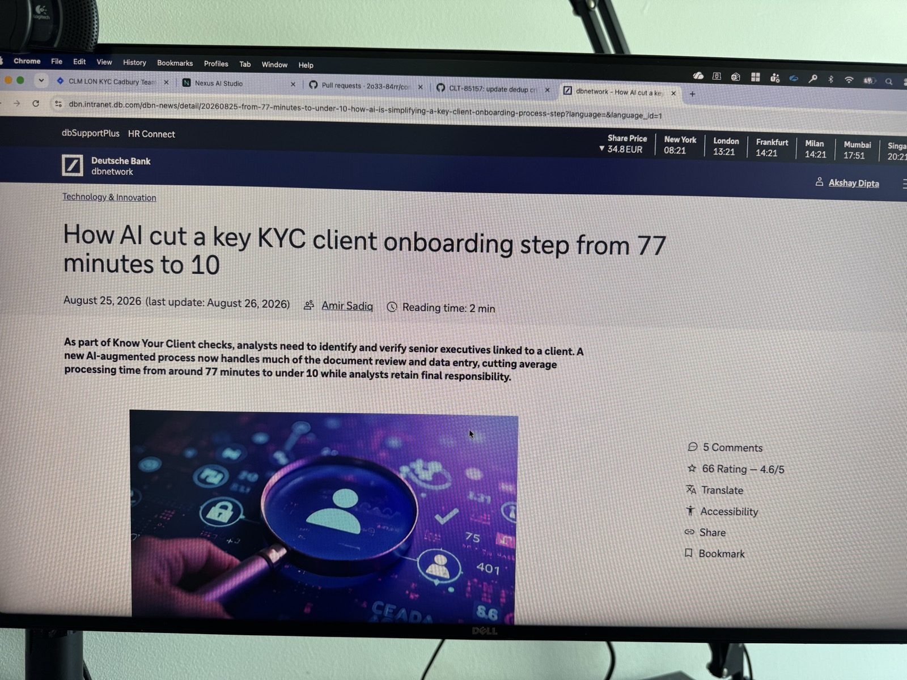

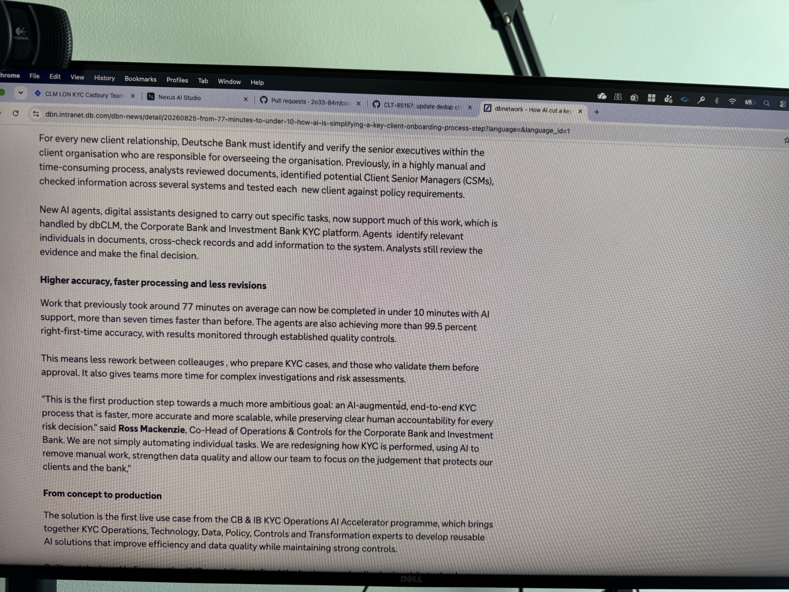

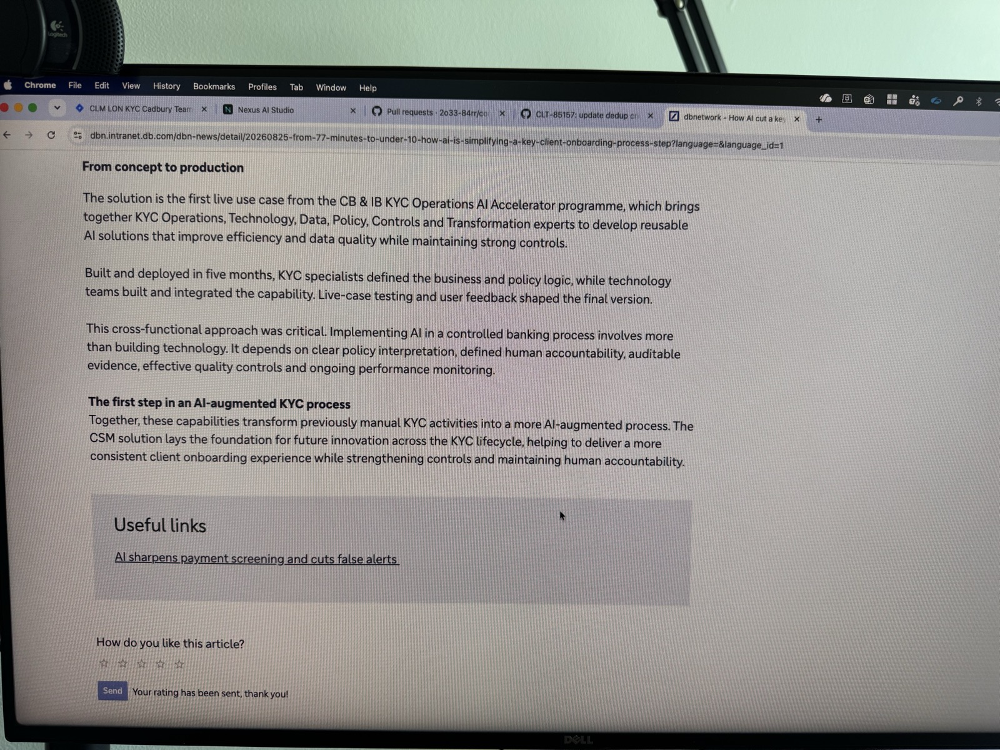

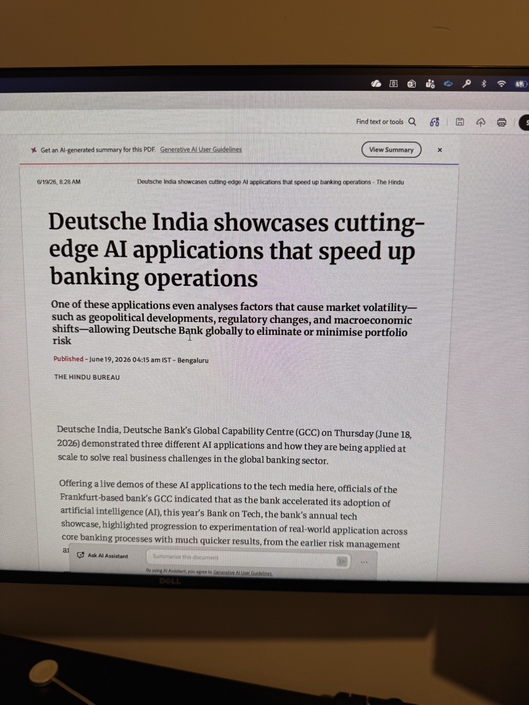

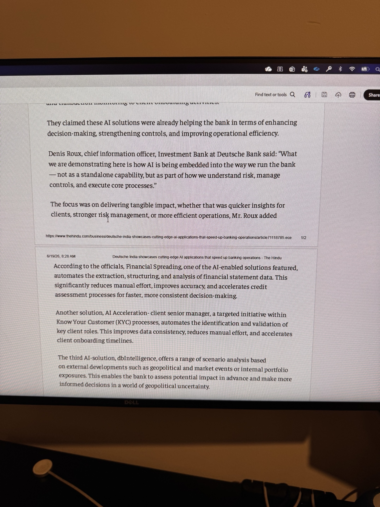

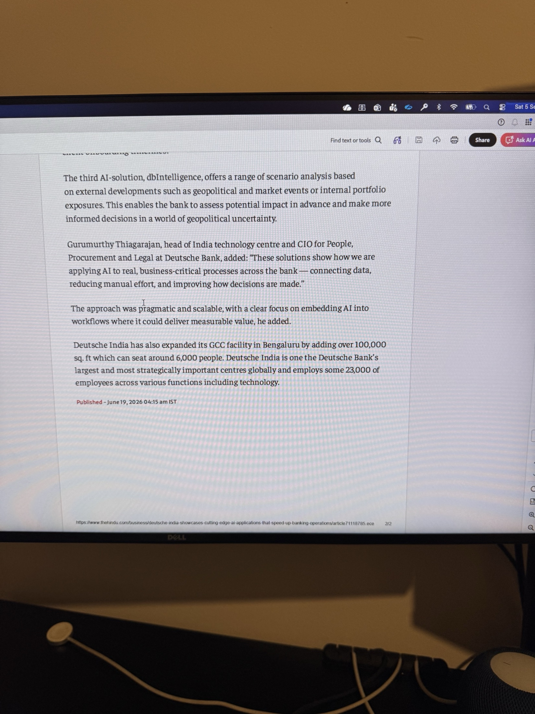

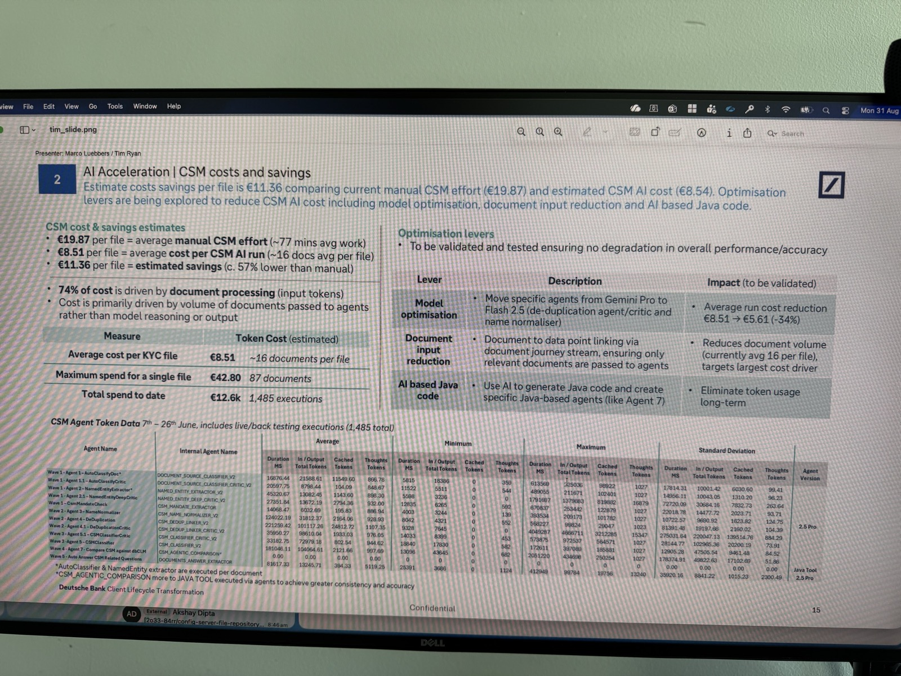

### Framework mapping

**Achieves.** A production result measured independently and published bank wide.
**Engages.** Five months of cross functional delivery with Operations, Policy, Data, Controls and Transformation.
**Influences.** The first agentic workflow in the business unit set the pattern that every subsequent one follows.
**Delivers.** Shipped into a controlled, regulated, audited process.
**Operates.** Ongoing cost and performance ownership after go live, with three optimisation levers in flight.

### So what

This is the proof that the framework was worth building. A platform with no users is an opinion. This one has a measured result, an independent cost analysis, and a Co-Head of the division on record about it.

---

## 6. Live Result Two, Who Owns And Controls A Client

**This is the section to spend the most time on with me. It is the hardest problem I have worked on, I own it end to end, and it is where the engineering is most distinctive.**

### The problem

Regulation requires the bank to establish who ultimately owns and controls a corporate client. In practice an analyst opens a case containing organisation charts, shareholder registers, certificates of incorporation, regulatory filings and client correspondence, frequently in several languages, and traces ownership upwards through layer after layer of holding companies, funds, trusts and partnerships. They apply group policy plus the rules of every country involved, and calculate the percentages by hand.

It is slow, it varies between analysts, and it is difficult to evidence to a regulator afterwards, because the reasoning lived in one person's head.

### What I personally did

All of it. I own this workflow end to end. The rule set, the architecture, the test suite, the deployment tooling and the partnership with the policy team are mine. The source repository holds ninety two commits, all of them mine, from 3 June to 4 September 2026. It has been live in production for a controlled group of one hundred users since August 2026.

### The design decisions I owned

**Decision one. One call, not six agents.**

An earlier attempt used a six agent pipeline. It was complex, expensive to run, and every handoff between agents was a place where context was lost and errors compounded. I collapsed it into a single call.

This is the opposite of the fashionable direction, so it is worth being explicit about why. Ownership tracing is not a set of separable subtasks. Deciding whether a party is an ultimate owner depends on the whole structure at once, including the layers above it and the parallel branches beside it. Splitting it across agents forced each agent to reason with partial context and then forced a later agent to reconcile conclusions drawn from different partial views. One call with the full picture is both cheaper and more accurate. I would rather defend a simpler architecture that matches the shape of the problem than a more impressive one that does not.

**Decision two. Four principles, written for a regulator rather than for an engineer.**

- **Evidence only.** No outside knowledge and no inference. Every assertion carries a verbatim quote from a document in the case.
- **Zero data loss.** No party is ever dropped for being below a threshold, at zero percent, or incomplete. It is recorded with its status.
- **Deterministic.** The same case must produce the same answer every time.
- **Fail closed.** A gap is recorded and flagged. It is never filled in with a plausible answer.

The fourth is the one that matters most. The failure mode that would end this system is not being wrong, it is being confidently wrong in a way nobody noticed. A recorded gap creates work for a human. An invented answer creates a regulatory problem.

**Decision three. Maker and checker, with explicit rules for when the checker is wrong.**

One agent extracts. A second agent reviews the output against seventeen acceptance criteria and returns pass, accept with notes, or retry. A retry sends the case back to be extracted again.

The genuinely interesting engineering is in what happens when the reviewer is mistaken, and this is the part I would most like to talk through with you. A naive implementation lets the extractor patch its answer to satisfy the complaint. That is exactly backwards. The reviewer is not evidence. If the extractor simply complies, a reviewer error produces precisely the fabrication the reviewer exists to prevent, and it now carries a review stamp on it.

So the rules require three things. The extractor re-extracts rather than patches. A review finding is treated as a prompt to re-read a document, never as evidence in its own right. And where the documents do not support the finding, the extractor must formally dispute it in writing and escalate to a human, rather than quietly changing its answer to make the complaint go away.

**Decision four. Deterministic ordering, not emergent behaviour.**

Sixteen mandatory processing gates run in a fixed order, from document inventory and translation through to completeness validation. A twenty two rung precedence ladder resolves which role each party holds, first match wins. This is deliberate. Emergent ordering is unreproducible, and unreproducible is disqualifying in this process.

### Scale of the rule set

- 1,597 lines of rules. Twenty six rules across forty three numbered sub sections.
- Sixteen mandatory processing gates in fixed order.
- Thirty seven fields per ownership record.
- A twenty two rung precedence ladder for role resolution.
- The deployed instruction is 219,859 characters. The generated deployment script is 263,272 characters.
- Forty five versioned releases to date.

### Engineering rigour applied to artificial intelligence

**This is the differentiator, and it is the thing I would most want an engineering panel to understand.** Instructions to a model are almost universally treated as prose that nobody tests. I treat them as production code.

**Two hundred and sixty five automated tests** pin the English rules to the output schema so that the two cannot silently drift apart. Examples of what they actually assert:

- `test_critic_criteria_names_match_schema_enum`, so a criterion cannot be renamed in the rules without the schema following.
- `test_every_record_property_is_named_in_the_system_prompt`, so no field exists in the contract that the instructions never mention.
- `test_direction_contract_is_consistent_across_prompts_and_schema`, which guards against inverting every ownership relationship in the system. This is the single highest consequence bug available in this domain, because an inverted relationship is syntactically valid, passes every schema check, and is completely wrong.
- `test_no_assertion_without_a_verbatim_quote`, which mechanically enforces the evidence only principle rather than trusting the prompt to.

**A run to run consistency harness.** Users reported that re-running the same case gave materially different results. I did not guess at a fix. I built the measurement first. The harness normalises away wording and ordering differences, then buckets the remaining differences into parties, links, numbers, classification and derived values. Narrative drift is reported but never counted against agreement, because a differently worded explanation of the same structure is not a defect. Only once I could measure the disagreement did I start fixing it.

**Regression discipline.** Every regression test had to be demonstrated failing against the pre-fix instruction before it was accepted, and then passing after. I made that policy after finding two earlier tests that were vacuous, passing regardless of the behaviour they claimed to protect. A test that cannot fail is worse than no test, because it produces false confidence.

**A determinism release.** One release resolved three critical and ten important internal contradictions inside the rules, added seven new rules and corrected nine. The test count went from twenty five to eighty two, then to two hundred and fifty six, and it stands at two hundred and sixty five today.

**Versioned deployment.** Instructions live as versioned rows in an Oracle table consumed by a Java service. A change is a new version, never an edit in place. The deployment script is generated rather than hand written, and then verified by decoding it back and comparing byte for byte against the source. Hand editing a hundred and ten thousand character instruction inside a script is an obvious way to corrupt production silently, so the process removes the opportunity.

**Reusable tooling.** I packaged the deployment tooling with a generate mode and a verify mode, and documented it, so the next person does not have to rediscover the constraints the hard way.

### Partnership with the business

The policy team supplied the requirements. I did not simply implement them.

- I ran a **clause by clause audit** of every supplied requirement, marking each as in, in with changes, or out, recording the reason wherever wording was changed or rejected.
- I put **fifteen written questions** back to the business, each citing the specific line in their own document, and ran four rounds of response in a single day.
- I **rejected supplied worked examples that were wrong.** One carried an inverted ownership relationship. Another had fund percentages that did not total one hundred. The business checked and supplied corrected figures.
- I **declined to implement one rule** because the business could not supply a worked example for it. My argument was that a rule which cannot be applied identically twice is worse than no rule, because it introduces variance while appearing to add rigour. That open item was pushed back rather than guessed at.
- I raised a **documentation defect** back to the business, because their source document still carried withdrawn rules and would disagree with the deployed instruction unless corrected.
- I **escalated three policy questions** to the standards owner for confirmation before deployment rather than making the interpretation myself.

**This is still going on, and I can show you this week's.** The most recent question document is dated 4 September 2026 and concerns a single phrase in one rule, whether a contractual partnership is a legal entity in its own right or a pool of entities that must not be recorded as one owner. It sets out what we understood the intent to be, asks the business to confirm or correct it, and states plainly at the top that anything left unanswered stays unimplemented.

That last line is the whole approach in one sentence. I will not guess at a rule on the business's behalf, and I will not let an unanswered question quietly become an engineering assumption that nobody can trace later.

The 2025 panel asked me to show cooperation rather than assert it. This is what that looks like with specifics attached, and it is current rather than historical.

### Known gaps, stated before you ask

I would rather give you these than have you find them.

- **No continuous integration on this repository.** The tests run manually. This is the gap I am least comfortable with and the next thing I am fixing.
- **The test suite is not in version control**, because the directory is excluded repository wide. That needs correcting.
- **The deployment script is executed by hand**, not through a pipeline.
- **No published volume or service level figures yet.** The rollout is deliberately limited to one hundred users, and I would rather report nothing than report a number from a controlled group as though it were a production rate.

The honest position is that the instruction engineering and the testing on this workflow are considerably more mature than the delivery pipeline around it, and I know it.

### Screenshots and links

Source repository: [LINK: ownership-prompts repository] (92 commits, all mine, 3 June to 4 September 2026)

*Screenshots to be added. Suggested: test suite output showing the 265 tests, a run to run consistency harness report, and a versioned instruction row in the deployment table.*

### Framework mapping

**Thinks.** Collapsed a six agent pipeline into one call by recognising the problem was not separable. Recognised that non determinism, not accuracy, was the real defect behind the user complaints, and built a measurement harness before attempting a fix.
**Designs.** Sixteen gate processing order, thirty seven field output contract, twenty two rung precedence ladder, and a maker checker loop with explicit dispute semantics.
**Delivers.** The second agentic workflow in the business unit to reach production, live for one hundred users.
**Operates.** Versioned deployment, generated and verified release artefacts, a verification checklist where every item was added because it caught a real bug.
**Controls.** Evidence only and fail closed by design. Two hundred and fifty six tests preventing rule drift. Every assertion traceable to a document quote for audit.
**Engages.** Clause by clause partnership with the policy team, fifteen written questions, four rounds resolved in a day.
**Influences.** Disputed incorrect business supplied examples and had them corrected. Refused to implement an unspecifiable rule and explained why.
**Achieves.** Replaced manual ownership tracing. Three critical and ten important rule contradictions found and resolved before they reached production.

### So what

The first workflow proved the framework works. This one proves it holds up on a genuinely difficult regulatory problem, under audit conditions, where being confidently wrong is the failure that matters.

---

## 7. The Foundations, Messaging Infrastructure

### The problem

Our platform runs on asynchronous messaging. It could not handle the load. Messages that failed sat in a database with no automated retry. State and validity calculations backed up daily. Analysts waited thirty to sixty minutes for a calculation result they needed in order to do their next piece of work. And when anything went down, messages were lost permanently, with no way to trace where the work had stopped.

### What I personally did

I designed and built the retry library, introduced the replacement messaging library, and added full lifecycle tracing. I am the Component Guardian for messaging across the business unit, which means every design and code change in this area is approved by me.

### The design decisions I owned

**Decision one. Retry through the database and a cluster safe scheduler, not by republishing.**

The library funnels every failure, from both producers and consumers, into a single unified persistence and retry workflow. Consumer failures are caught through a global error channel that intercepts exceptions from any listener. Producer failures are caught the same way.

On failure, the topic is matched against configured retry patterns, and the message payload plus its headers and retry count are written to a database table. A single cluster safe scheduler, using distributed locking through ShedLock, periodically scans that table, finds messages due for retry under an exponential backoff schedule, and invokes the correct handler bean to reprocess the message.

The important detail is the last one. **A retry calls the Java business logic directly. It does not republish to the message broker.** Republishing is the common approach and it is wrong here, because it re-runs everything downstream of the original publish, which produces duplicate side effects, and it makes the retry indistinguishable from a genuine new event in every log and every trace. Invoking the handler directly retries exactly the work that failed and nothing else.

**Decision two. Exponential backoff, because the usual failure is a struggling downstream system.**

Delays increase automatically, five minutes then ten then twenty and onward. Immediate retry against a downstream system that is failing under load converts a degradation into an outage. Backing off gives it room to recover.

**Decision three. A library with one switch, not a pattern in a document.**

Enabled with a single property, `clm.kafka.retry.enabled=true`. Retry policies are configured globally or per topic, and can vary by the exception thrown. Topic to handler routing is configured in a settings file. Retry limits, intervals, batch size and backoff are all configuration.

That last decision is why it got adopted. A recommended pattern gets implemented five different ways by five teams. A library with one switch gets used, and a fix in it propagates to everyone automatically.

**Decision four. Observability across the old library as well as the new one.**

I introduced full lifecycle tracing for messages in both the new library and the legacy one. Adding it only to the new one would have left the majority of live traffic dark for as long as the migration took. It found production bugs that had previously been undetectable, because nobody could see where a message stopped.

### Evidence

- Analyst wait time went from thirty to sixty minutes down to seconds.
- Five hundred thousand messages processed per day in state validation.
- Daily backlogs in state and validity calculation eliminated.
- Every message traceable end to end, which found live bugs that were previously invisible.
- Adopted by multiple teams across the business unit, published as `com.db.clm.kyc:clm-kafka-retry`.
- I am Component Guardian for this area across teams.

### Screenshots and links

Source repository: [LINK: clm-kafka-phoenix-retry repository]

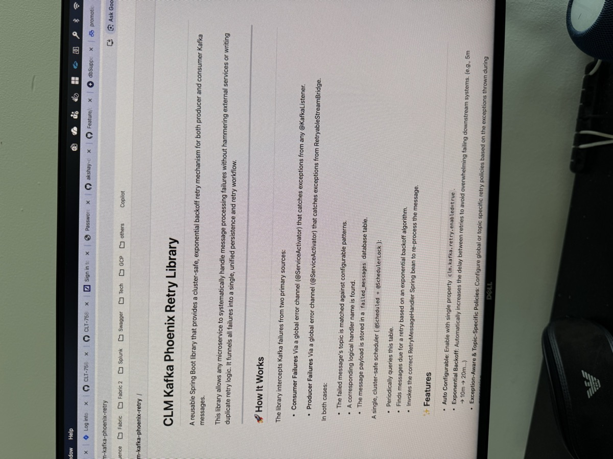

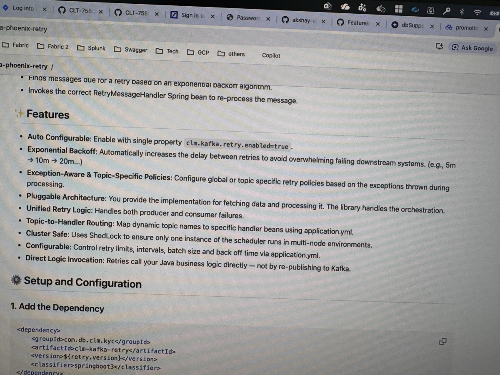

### Framework mapping

**Designs.** Pluggable architecture, cluster safe scheduling, exception aware policy, and a deliberate decision on retry semantics.
**Operates.** Full message lifecycle tracing, and production bugs found that were previously undetectable.
**Controls.** Distributed locking, configurable policy, and a complete audit trail of retries.
**Influences.** Adopted across the unit rather than mandated, because it was easier to use than to avoid.
**Achieves.** Thirty to sixty minutes down to seconds, half a million messages a day.

### So what

An analyst who waited an hour for a result did something else and came back. That context switch cost more than the hour did. Now the result is there when they look.

---

## 8. The Foundations, Documents And The State Machine

### The problem

A client review asks a set of compliance questions, and every answer has to be evidenced by documents. Analysts linked documents to the questions they answered by hand, and re-checked by hand whether an existing answer still held. It was slow and it was the sort of repetitive work where mistakes are both easy and consequential.

This is also the platform the two live results in sections 5 and 6 stand on, which is why it is here and not in an appendix.

### What I personally did

I built the state machine at the centre of the platform. It calculates the state of every question and of every document. A question's state determines what evidence is required and when that question is ready to be worked. A document's state determines whether the document can be relied on as evidence.

On top of that I designed and built automatic association of documents to questions on upload, and automatic dissociation when a newer valid document supersedes an older one. The validity calculation had grown scattered across the codebase, and I consolidated it into a single state transition framework. I removed the post processing bottleneck with a parallel processing model.

I still own this platform. **I was resolving production issues in it this month**, on documents arriving from an external credit reference source and on automatic association behaviour in the fulfilment interface.

### Why the two live workflows depend on this

Three dependencies, and none of them is decorative.

1. The agents read documents that my association logic placed against the correct question. Without that, there is no reliable mapping from a document to the question it answers.
2. The work the agents pick up exists because the state machine decided a question was ready to be worked.
3. The agents act only on documents the state machine has marked good.

Put plainly, both workflows in sections 5 and 6 only ever see work my state machine released, and only ever act on documents it marked good. The artificial intelligence sits on top of this. It does not replace it.

### The design decisions I owned

**Decision one. State is the contract, not a validity flag.**

The platform does not ask "is this answer still valid" as a one off calculation. It maintains the state of every question and every document, and everything downstream reads that state rather than recomputing its own view. That is what makes it safe for two independent workflows to consume the same record and reach the same conclusion. A scattered validity rule set cannot offer that, because the same question could be answered differently depending on which path reached it.

**Decision two. Dissociation matters as much as association.**

Automatically linking a document to a question is the obvious half. Automatically unlinking one that a newer valid document has superseded is the half that keeps the record accurate. Without it the system accumulates stale evidence that still looks current, which is worse for an auditor than a missing link, because a missing link is visible and a stale one is not.

**Decision three. Parallelise the post processing.**

Post processing was the throughput bottleneck. I moved it to a parallel model, which is what allows the volume the platform now handles.

### Evidence

- Over forty thousand document operations completed with no human involvement.
- Carrying live regulatory volume for every client review on the platform.
- Still owned in production, with active issue resolution this month, on documents from an external credit reference source and on association behaviour in the fulfilment interface.
- Chris Ashley, Director, worked with me on the initial build of this platform and is one of my endorsers.

**On attribution.** That operations figure describes the documents and state platform as a whole. I am not claiming it for automatic association on its own, and if you ask me to split it out I cannot.

### Framework mapping

**Designs.** A state machine over questions and documents, automatic association and dissociation, and parallel post processing.
**Delivers.** Shipped and carrying live regulatory volume.
**Operates.** Continuing production ownership rather than handover after delivery.
**Achieves.** Five million euros contributed, forty thousand operations automated.

### So what

The business puts the saving from this platform at five million euros. That is the end the whole thing was built for, and everything above is how it was earned: forty thousand operations no analyst had to do, on a record that stays accurate on its own rather than because somebody remembered to tidy it.

The second return is the one that is easy to miss. Every artificial intelligence result in sections 5 and 6 is only as trustworthy as the state underneath it, and that state is the part I own.

---

## 9. Beyond My Team

The 2025 panel told me my contribution beyond my own team was weak and not visible. This section is the answer to that.

### Contribution to the open source community

I contributed a new integration module to **LangChain4j**, the open source Java framework for building artificial intelligence applications. The contribution adds a Google generative artificial intelligence chat model with streaming support.

`github.com/langchain4j/langchain4j/pull/4658`

This is worth separating from the rest. Everything else here is a contribution inside Deutsche Bank. This is a contribution to the wider industry, in the open, under my own name, reviewed by maintainers who have no reason to be kind about it. LangChain4j is also the framework our own artificial intelligence platform is built on, so this is giving back to something we directly depend on rather than to something unconnected.

### Driving re-use across the business unit

Re-use is one of the things this process explicitly asks about, so here is the list.

| What | Reach |
|---|---|
| Nexus AI framework | Adopted across the business unit. Under review by the Chief Strategy and Innovation Office as a candidate bank wide standard |
| Nexus AI Studio | One Maven dependency and one property. Any service on the framework gets the interface with no code |
| PromptLint | Available across the unit, with a web interface for teams that do not write Java |
| Messaging retry library | Adopted by multiple teams across the unit |
| Messaging observability | Applied to the legacy library as well as the new one |
| Shared coding standards | The default in every service in the unit |

### Teaching it to the business unit

On 11 June 2026 I presented a session in the business unit's knowledge sharing series, titled "Building Production-Grade GenAI Agents with CLM-Nexus-AI and Prompt-Lint".

- **140 people attended.** The roster held 144.
- It was scheduled for an hour and ran **1 hour 24 minutes**, because the questions kept coming.
- Average attendance time was **33 minutes**, on a session where people can drop out silently at any point.
- I presented for **57 minutes** of it.
- It was **recorded**. The recording and the transcript sit on the internal wiki alongside the framework documentation, so the session keeps working after the day. Recording: [LINK: 11 Jun 2026 session recording]. Transcript: [LINK: session transcript].

The audience had already been given a session on the equivalent Python tooling, so this one had to answer the obvious question, which is why we are doing this in Java at all. That is the same argument as in section 2, made to the engineers who would have to live with the answer rather than to management.

The chat afterwards ran to more than a dozen unprompted messages. A sample, verbatim: "very detailed presentation", "Very Good Presentation", "Great session", "thanks, its a good presentation", "Thanks great session".

**Why this belongs in the case rather than in a list of activities.** A framework is only adopted if people understand it. Building it and then leaving other teams to discover it from a wiki page would have been the easy version. Standing in front of 140 colleagues to teach it, and taking the questions, is what turns a repository into a platform other teams actually use.

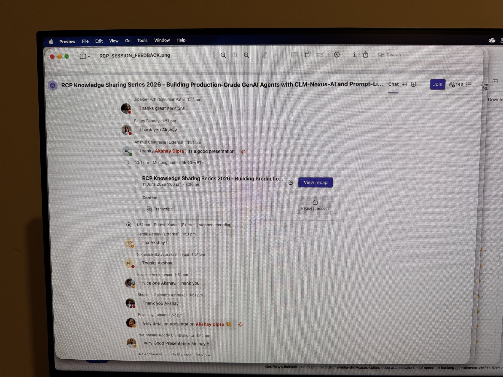

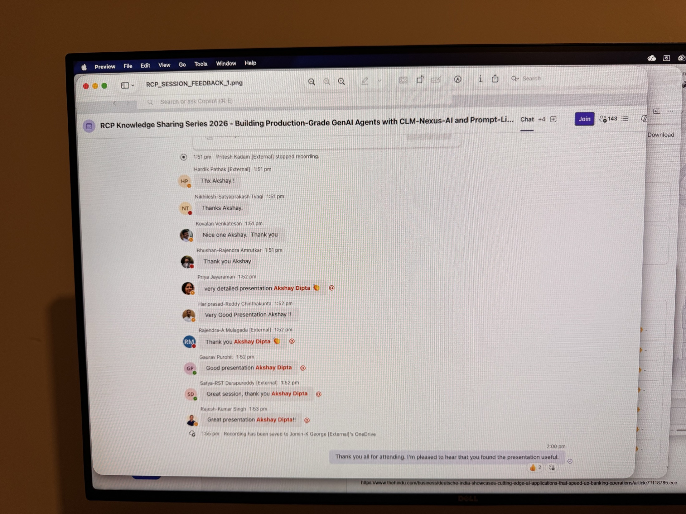

### Shared coding standards

The unit had no shared coding standards. No formatting rules, no static analysis enforced at build time. Every developer and every team had their own style, code reviews were spent arguing about formatting rather than about logic, and there was no automated quality gate on code hygiene at all.

Nobody asked me to fix this. I built shared Maven build modules bundling static rule enforcement and automatic formatting, which any service inherits by adding a single reference. No per project configuration. It is now the standard across every service in the business unit, and a new joiner gets the guardrails from their first commit.

The reason I mention a build configuration alongside artificial intelligence work is that it is the same instinct in both cases. Quality is something you build a gate for, not something you ask people to remember. PromptLint is that same idea applied to prompts.

### Visibility outside the business unit

- **National press.** The senior managers workflow was one of three artificial intelligence applications Deutsche Bank demonstrated to the technology press at Bank on Tech in Bengaluru on 18 June 2026, and was named in The Hindu the following day. Details and the attribution position are in section 5.
- **Chief Strategy and Innovation Office.** A Director level Lead Data Scientist reviewed Nexus AI and is evaluating it as a potential bank wide standard framework for artificial intelligence.
- **Another division's technology team.** I demonstrated the framework to a Managing Director's team, who expressed interest in onboarding onto it.

### Building the culture

- Participant in the Deutsche Bank hackathon in 2024, building software to assist dementia patients.
- Team lead in the Deutsche Bank hackathon in 2025.
- Contributing to the environmental sustainability initiative in 2026.
- Mentoring engineers through pairing and code review. As Component Guardian, every design and code approval in my areas goes through me, which I treat as a teaching opportunity rather than a gate.

### Framework mapping

**Engages.** Contributing outside the bank, and mentoring inside it.
**Influences.** Standards adopted unit wide, and a framework now being reviewed bank wide.
**Achieves.** A quality culture established through automation rather than exhortation.

---

## 10. Sponsors And Endorsements

### Marco Luebbers
**Managing Director. Head of Know Your Customer Operations Steering and Perimeter Governance.**

Presented the cost and savings analysis for the senior managers workflow to management. This is the analysis reproduced in section 5.

*Endorsement to be confirmed.*

### Tong Su
**Director. Lead for the Chief Technology Office initiative.**

Worked with me directly on the artificial intelligence initiative.

> "One of the most outstanding software engineers I've had the pleasure to collaborate with. Your deep expertise in Java stands out, but what truly impresses me is your consistent focus on building clean and reusable code that benefits not just our immediate project, but also the wider engineering community."

### Lalitha Lalwani
**Director. Architect, Chief Technology Office Platform.**

Worked with me directly on the artificial intelligence initiative, and observed the end to end ownership of the framework from research through to production.

*Endorsement pending.*

### Chris Ashley
**Director. Conduct and Control Risk, Corporate Bank and Investment Bank, Operations and Controls.**

Worked with me on the initial build of the documents and state platform described in section 8.

**Note on the 2025 feedback.** The panel asked for one sponsor from technology and one from outside Client Life Cycle Management. Tong Su and Lalitha Lalwani are both technology, from the Chief Technology Office. Marco Luebbers and Chris Ashley are both outside my area, in Operations and Controls. That covers both requirements.

---

# Appendix A. Framework Mapping At A Glance

The target for this level is most dimensions at level three, described as skilled, with behaviours growing faster than technical capability.

## The four behaviours

| Behaviour | Strongest evidence |
|---|---|
| **Thinks** | Reversed a technology direction by argument. Collapsed a six agent pipeline into one call because the problem was not separable. Recognised non determinism as the real defect behind user complaints and built the measurement before the fix |
| **Engages** | Five month cross functional delivery with Operations, Policy, Data, Controls and Transformation. Clause by clause partnership with the policy team, fifteen written questions, four rounds in a day. Open source contribution. Mentoring through pairing and review |
| **Influences** | Convinced technical management to change language direction for the unit. Framework adopted unit wide and under review bank wide. Coding standards adopted everywhere. Disputed the business's own worked examples and had them corrected |
| **Achieves** | 77 minutes to under 10. Over 99.5% right first time. 57% cheaper. A day to an hour to build an agent. 30 to 60 minutes down to seconds. 500,000 messages a day. 5 million euros contributed |

## The four technical capabilities

| Capability | Strongest evidence |
|---|---|
| **Designs** | Two tier framework architecture designed from nothing. Sixteen gate processing order, thirty seven field contract, twenty two rung precedence ladder, maker checker with dispute semantics. Centralised state transition framework. Cluster safe retry architecture |
| **Delivers** | Two production workflows, a framework, a quality analyser, a retry library, a messaging observability layer, and an open source module |
| **Operates** | Full observability across both framework tiers and both messaging libraries. Versioned deployment with generated and verified artefacts. Continuing production issue resolution this month. Post go live cost optimisation |
| **Controls** | Deterministic guardrails independent of the model. Evidence only and fail closed design. 265 tests preventing rule drift. Automated code quality gates unit wide. Complete audit trail on every agent execution |

---

# Appendix B. Every Number, With Its Source

| Number | What it measures | Source |
|---|---|---|
| 1 of 3 | Applications the bank demonstrated to national media at Bank on Tech, 18 June 2026 | The Hindu, 19 June 2026 |
| 77 minutes to under 10 | Senior managers workflow, processing time per case | Bank intranet article, 25 Aug 2026 |
| More than 7x faster | Same | Same article |
| Over 99.5% | Right first time accuracy | Same article |
| 4.6 out of 5, 66 ratings | Reader rating of that article | Article page |
| 19.87 to 8.51 euros | Cost per case, manual against automated | Cost analysis, Marco Luebbers and Tim Ryan |
| 11.36 euros, 57% | Saving per case | Same analysis |
| 12,600 euros, 1,485 executions | Total spend, 7 to 26 June, live and back testing | Same analysis |
| 16 documents average, 87 maximum | Documents per case | Same analysis |
| 74% | Share of cost driven by document processing | Same analysis |
| 8.51 to 5.61 euros, 34% | Expected effect of the model optimisation lever | Same analysis, not yet validated |
| A day to about an hour | Time to build an agent, before and after Nexus AI | Framework adoption |
| 100 users | Controlled rollout of the ownership workflow | Production status, Aug 2026 |
| 92 commits | Ownership workflow repository, all mine, 3 Jun to 4 Sep 2026 | Repository |
| 265 collected, 264 pass and 1 expected failure | Automated tests on the ownership rule set | Test suite, run 5 Sep 2026 |
| 1,597 lines, 26 rules, 43 sub sections | Ownership rule set size | Rule set |
| 16 gates, 37 fields, 22 rungs | Ownership processing order, output contract, precedence ladder | Rule set |
| 219,859 characters | Deployed ownership instruction | Deployment artefact |
| 45 | Versioned releases of the ownership instruction | Repository |
| 17 criteria | Acceptance criteria checked by the reviewing agent | Rule set |
| 15 questions, 4 rounds in a day | Questions raised back to the policy team | Correspondence |
| 3 critical, 10 important | Rule contradictions found and resolved | Determinism release |
| 30 to 60 minutes to seconds | Analyst wait for a calculation result | Messaging rebuild |
| 500,000 a day | Messages processed in state validation | Messaging rebuild |
| 5 million euros | Savings contributed to | Documents and state platform |
| 40,000 plus | Document operations with no human involvement | Documents and state platform |
| 140 attended | Business unit knowledge sharing session I presented, 11 Jun 2026 | Session attendance report |
| 1h 24m | That session's actual length, against a scheduled hour | Same report |
| 57m 42s | My share of that session as presenter | Session recording and transcript, on the wiki |
| 548 tests in 71 files | Nexus AI Studio front end test suite, 545 passing locally | Repository, run 5 Sep 2026 |
| 57 commits | Nexus AI Studio repository, 31 May to 26 Aug 2026 | Repository |
| ~20,600 lines, 55 components | Nexus AI Studio front end size | Repository |
| 8 dimensions | Quality dimensions in PromptLint | PromptLint documentation |
| 13 years | Time in financial technology | Career |

**One correction I want on the record.** A slide header in the cost analysis reads 8.54 euros. Its own bullet points and its own arithmetic both say 8.51, because 19.87 minus 8.51 is 11.36, which is the stated saving. The correct figure is **8.51**. I am flagging it so that if a panellist has seen the slide and quotes 8.54, you know why the numbers differ and that I checked rather than guessed.

**One correction from last year.** In 2025 I described a saving of twenty five million. That figure was the target for a programme considerably broader than my work. The defensible figure attributable to the document platform is **five million euros**, and that is the figure I use now.

---

# Appendix C. Glossary

| Term | Plain English |
|---|---|
| **Know Your Customer** | The regulatory obligation to establish who a client is, who owns them and who runs them, before doing business with them |
| **Client Life Cycle Management** | The platform and the teams that carry out that work. My business unit |
| **Client Senior Manager** | A senior executive responsible for overseeing a client organisation. The bank has to identify and verify these people for every new client |
| **Ultimate ownership and control** | Who really owns a company once you trace through every holding company, fund and trust above it |
| **Agent** | Software that gives a task to a large language model, gives it tools it may use, and does something with the answer |
| **Agentic workflow** | A business process carried out by several agents working together, with checks between them |
| **Guardrail** | Ordinary code that validates what goes into a model and what comes out, independently of whether the model followed its instructions |
| **Maker and checker** | One party does the work, a second independently verifies it. A long standing banking control, here applied to two agents |
| **Prompt** | The written instruction given to a model. It defines the behaviour, which is why I treat it as production code |
| **Static analysis** | Checking an artefact for defects by reading it, without running it. Normal for code, and what PromptLint brings to prompts |
| **Right first time** | The proportion of cases that need no correction afterwards |
| **Component Guardian** | The named owner of a technical area. Every design and code change in it is approved by them |
| **LangGraph Studio** | The standard interface, in the Python world, for seeing and running this kind of agent workflow. Nexus AI Studio is deliberately built to the same contract, so it is a like for like replacement in Java |
| **Checkpoint** | A saved snapshot of a workflow's state at one step. Studio shows what changed between one checkpoint and the next, which is how you see what a run actually did |
| **LangChain4j** | The open source Java framework for building artificial intelligence applications. Our platform is built on it, and I have contributed to it |
| **Exponential backoff** | Waiting progressively longer between retries, so a struggling system is given room to recover instead of being hammered |

---

# Appendix D. Questions You May Get, And My Answers

**"Did he really build the framework on his own, or is that a team's work being claimed by one person?"**
The framework is mine. Research, proof of concept, architecture, implementation and the architecture documentation. The workflows built on it are a different matter, and section 5 sets out exactly what was cross functional there.

**"The bank wide article does not name him. So what is his actual contribution?"**
He built the framework every agent in it runs on, and he delivered the first agentic workflow in the business unit. He is deliberately not claiming the headline result, and section 5 says so in writing. He does own the second workflow end to end.

**"Java rather than Python for artificial intelligence work. Was that the right call?"**
Two workflows in production say yes. The argument was that the library advantage of Python was smaller than the permanent cost of a second stack that no engineer in the unit maintains, no pipeline builds and no monitoring covers. He made the case to technical management and won it. It is also the reason he could contribute to LangChain4j, because that is the ecosystem he committed the unit to.

The strongest version of the answer is that he did not just accept the tooling gap the decision created. He rebuilt the missing tool, Nexus AI Studio, and built it to the same interface contract as the Python original, so the unit gets the capability without the second language. Ask him about that. It is the point where the decision is either vindicated or not.

**"Collapsing six agents into one call sounds like a step backwards."**
The opposite. Ownership tracing is not separable. Deciding whether a party is an ultimate owner depends on the whole structure at once, so splitting it forced each agent to reason with partial context and forced a later agent to reconcile conclusions drawn from different partial views. One call with the full picture is cheaper and more accurate. He chose the architecture that fits the problem over the one that sounds more sophisticated.

**"How do you know the artificial intelligence is not just making things up?"**
Four ways, all designed in rather than added afterwards. Every assertion must carry a verbatim quote from a document. A second agent reviews every output against seventeen criteria. A missing answer is recorded as a gap and never filled in. And two hundred and sixty five automated tests hold the rules and the output contract together so they cannot drift apart.

**"What happens when the checking agent is wrong?"**
This is the question worth asking him, and he has an answer. The extractor must re-extract rather than patch, must treat a review finding as a prompt to re-read a document rather than as evidence, and must formally dispute a finding the documents do not support and escalate to a human. Without those rules a mistaken reviewer causes exactly the fabrication the reviewer exists to prevent.

**"What is weak in his work?"**
He will tell you before you ask. The ownership workflow has no continuous integration, its test suite is not in version control, and its deployment script is run by hand. He has no published volume figures for it because the rollout is limited to a hundred users and he will not present a controlled group number as a production rate. See the end of section 6.

**"Firmwide contribution was the gap in 2025. Is it fixed?"**
The workflow he built the framework for was one of three applications Deutsche Bank chose to demonstrate to national media in India in June, and it was named in The Hindu. An open source contribution to LangChain4j under his own name. A framework adopted unit wide and now under review by the Chief Strategy and Innovation Office as a candidate bank wide standard. Coding standards that are the default in every service in the unit. Two hackathons, one as team lead, and the sustainability initiative.

**"The newspaper article does not name him either. Is this being stretched?"**
No, and he says so himself in section 5. The claim is narrow and it is checkable. The bank picked three pieces of artificial intelligence work to show the national press. One of them was the workflow that runs on the framework he built and that he delivered first in the unit. He is asking to be judged on having built the thing, not on having been quoted.

**"Has anyone outside his own team actually taken this up?"**
The framework carries two production workflows and is under review by the Innovation Office as a bank wide standard. He also taught it to the unit directly, in a knowledge sharing session on 11 June 2026 that 140 people attended and that overran by twenty four minutes on questions. It was recorded, so it is still working.

**"Is he an engineer or a manager?"**
An engineer. He writes the code, ships it, and owns it in production. He was fixing live issues in the document platform this month.

---

# Appendix E. Your Five Minutes

*Written to be said out loud. Roughly four minutes at a normal pace, which leaves room to be interrupted.*

Akshay is a Senior Engineer in Client Life Cycle Management, the part of the bank that proves it knows who its clients really are. Thirteen years in financial technology, here since March 2023.

Two years ago his business unit had no artificial intelligence capability of any kind. Every team that wanted to build something started from a blank page, and one agent took a full day to build.

He changed the direction first. The unit was heading towards Python. He argued that every service, every pipeline and every engineer there is Java, and that a second stack would be a permanent cost nobody could carry. He took that to technical management and he won the argument. Then he built the framework himself. Research, proof of concept, architecture, code. Building an agent went from a day to an hour.

There was a cost to choosing Java, which is that the ready made tooling for this is all Python. So he built that too. Nexus AI Studio draws every workflow as a picture that animates while it runs, and lets the people who own the policy compare and change the instructions the AI follows without waiting for a software release. He built it to the same interface as the industry standard tool it replaces, which is what makes the Java decision defensible rather than merely brave.

He then went and used it, which is the part that matters, because a framework nobody uses is worth nothing.

The first workflow finds the senior managers responsible for running a client. Seventy seven minutes of manual work per case, now under ten. Over ninety nine and a half percent right first time. Fifty seven percent cheaper, on an independent cost analysis presented by a Managing Director. It was published bank wide on the intranet in August and rated four point six out of five by sixty six people, and the Co-Head of Operations and Controls for the Corporate and Investment Bank is quoted in it.

Before that, in June, the bank held its annual technology showcase in Bengaluru and demonstrated three artificial intelligence applications to the national press. This was one of the three. It was named in The Hindu, with the Chief Information Officer of the Investment Bank quoted alongside it. Out of everything the bank could have shown, it showed this.

He is careful about that one, and I want to be careful too. That was a five month cross functional delivery. Policy, Operations, Data, Controls and Transformation all had a hand in it. What is his is the framework every agent in it runs on, and the fact that it was the first agentic workflow in the business unit. He told us that himself, before we asked.

The second workflow he owns end to end, and it is the harder one. Working out who ultimately owns and controls a corporate client, tracing up through holding companies, funds and trusts, across documents in several languages. Live for a hundred users.

Here is what makes him different as an engineer. Most people treat the instructions they give artificial intelligence as prose. He treats them as production code. Two hundred and fifty six automated tests on them. When users said the same case gave different answers on different days, he did not guess at a fix, he built a harness to measure the inconsistency first. And he did not simply implement what the policy team gave him. He audited their rules clause by clause, put fifteen written questions back to them, and told them two of their own worked examples were wrong. One had the ownership pointing the wrong way. They corrected them.

Underneath all of it he rebuilt the messaging infrastructure. Analysts used to wait up to an hour for a result and messages were lost permanently on any outage. Now it is seconds, and half a million messages a day, fully traceable. He still owns the document platform and was fixing production issues in it this month.

Inside the bank, he taught the whole thing to the business unit. He ran a knowledge sharing session in June that 140 people attended, which overran by nearly half an hour because of the questions, and it was recorded so it is still being used. He did not just build a platform and leave people to find it.

Outside the bank, he contributed a module to LangChain4j, the open source Java framework our own platform runs on.

He was turned down in 2025, and the feedback was that he could not show contribution beyond his own team and had no sponsors. Since then he has built a framework the Innovation Office is evaluating as a bank wide standard, put a workflow on the front page of the internal news and into the national press, contributed to open source under his own name, and has four endorsers including two Directors and a Managing Director.

He is an engineer who sets direction for a business unit, owns design rather than just delivery, and has production evidence rather than proposals. That is a Vice President.

---

*Prepared by Akshay Dipta, September 2026. Repository links marked [LINK: ...] are to be completed before circulation.*
